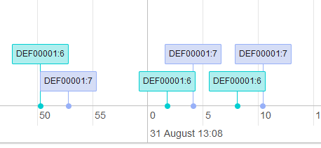

LoRaWAN Netzwerkserver
===================
Verwendet wurde der Open-Source LoRaWAN-Netzwerk und Applikations-Server von Petr Gotthard\
https://github.com/gotthardp/lorawan-server
\


# Setup
Das Setup das LNS muss für jeden Aufbau separat vorgenommen werden
- Geräte vorkonfiguriert (für ABP - authentication by personalisation)
- gewünschte Eigenschaften
- Adaptiv Data Rate\
...


# Backend
Das Backend des Servers ist die Schnittstelle zu dem SCHC-Gateway.
Hier wurden eigene Handler und Connectoren erstellt.

Der Handler verarbeitet die Uplinks/ Downlinks und berietet diese in eine gewünschte Form auf.

**Meine Uplink Parser Funktion geschrieben in Erlang**
```
fun(#{devaddr:=DEVADDR, data:=DAT, port:=PORT}=Fields, Data) ->
      #{hexSCHCData=> lorawan_utils:binary_to_hex(DAT),
devL2Addr=> lorawan_utils:binary_to_hex(DEVADDR),
rulePort=> PORT}
end.
```
Das Ergebnis schickt der Handler an einen verknüpften Connector.
Dieser leitet die Nachricht an eine verknüpfte Adresse weiter - in diesem Fall hier an den Gateway-Input:\
```
Format           = JSON
URI              = https://localhost:51225
Publish Uplinks  = /ul
```

Der Handler bildet auch die REST-API ab, mit welcher Downlink an den LNS gesendet werden können:
```
Format          = JSON
URI             = http:
Received Topic  = /in/{devaddr}
```
\
\
\
Der LNS zeigt in einem GUI die Ein-/ Ausgehenden Pakete:


