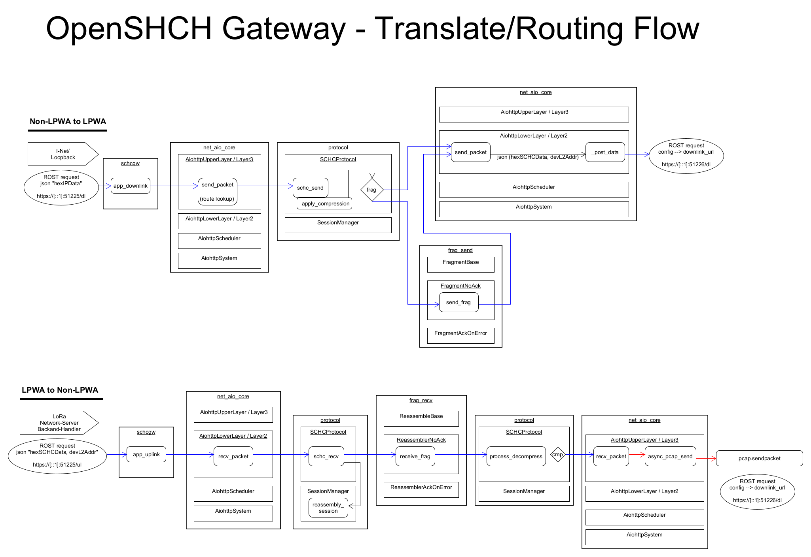

SCHC Backend Gateway
===================

siehe https://github.com/openschc/openschc für Grundlagen

Das Gateway ist in diesem Projekt als zentrale Schnittstelle implementiert.
Aufbauend auf dem OpenSCHC Projekt biete es:
- senden der RuleID im LoRaWAN Port-Parameter (Reduzierung der Payload-Größe)
- eine weiterleitung der Uplink-Pakete in das Internet an eine beliebige Zieladresse
- das Weiterleiten von aus dem Internet an der Netzwerkschnittstelle des Servers eingehende Pakete an das Gateway
- automatisches scannen aller IPs, welche zu LoRa Nodes gehören
- übermittlung von Payload Inhalten
- IP-Paket Generierung für ausgehende Pakete
- Bugfixing

#Translate/ Routing Flow
der von mir ermittelte Programmfluss des SCHC Gateways:


*(siehe doku)*


###Ein- und Ausgabe Interfaces des Gateway
- uplink (LNS --> Gateway)\
```json {addr, data, port} to localhost:51225/ul```


- downlink (Inet --> Gateway)\
```REST API - post to localhost:51225/dl```


- downlink (Gateway --> LNS)\
```REST API - post to localhost:8080/in/{devaddr}```

#Setup
die Ordner müssen zu dem Systempfad hinzugefügt werden:

```
export OPENSCHCDIR= {..} /openschc
export PYTHONPATH=  {..} /openschc/src
```

zum starten des Gateways:
1. anpassen der zentralen Konfigurationsdatei (gateway-config.json) für Regeln, Adressen, Interfaces
2. korrekte Angabe das mit dem Internet verbundenen Netzwerkinterface [-i ...] (hier: ens192)
```
python3 gateway.py -c gateway-config.json -d -i ens192
```


#Debug

zum debuggen empfielt es sich, Testnachrichten manuell an die jeweiligen Übergabepunkte für Up-/Downlink zu senden

###Uplink (LNS --> GW):
```
curl -X POST -k -H 'Content-type: application/json' -d '{"hexSCHCData":"578616d706c65","devL2Addr":"A2345678", "port": "6"}' https://[::1]:51225/ul
```

###Downlink (Inet --> GW):
```
curl -X POST -k -H 'Content-type: application/json' -d '{"hexIPData":"60123456001e111efe800000000000000000000000000001fe80000000000000000000000000000216321633001e0000410200010ab3666f6f0362617206414243443d3d466b3d65746830ff8401822020264568656c6c6f"}' https://[::1]:51225/dl
```