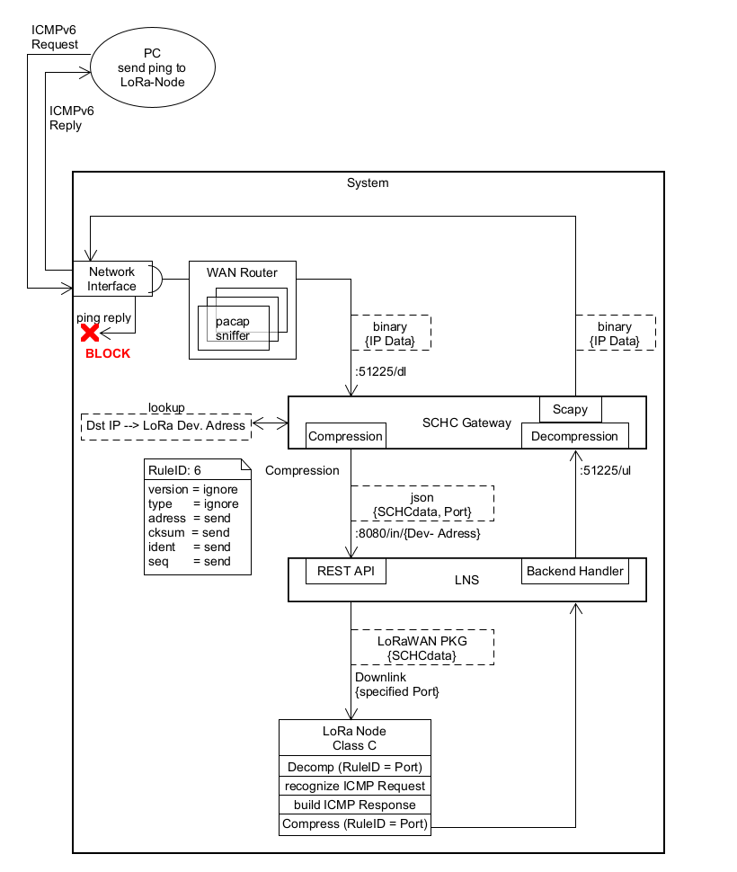

ICMPv6 Responder Client (Anwendungsbeispiel)
===================

Die SCHC Library hinter meinem Anwendungscode basiert auf https://github.com/ltn22/SCHC/tree/master/python/examples/coap_client.
In dieser wurden Bitmap-Fehler behoben, die Übertragung von IPs in SCHC-Paketen ermöglicht (Implementierung dedizierter Buffer in der richtigen Größe) usw.
Auch die Portierung der RuleID als LoRa-Port wurde hier implementiert (Änderung SCHC-Comp./Decomp. Flow, weiter Methoden ...)
*(siehe Beispiel CoAP)*

Ebenso wurde in diesem Beispiel in der Bibliothek auch die Fähigkeit zum (De-)Komprimieren/ Parsen von ICMPv6-Paketen implementiert (Feld- und Speicher-Definitionen).


# Setup
Verwendet wird ein Pycom LoPy auf einem Pysense Shield.

Bei Betätigung eines Buttons (LoPy Pin - D10 - wurde verwendet) wird eine CoAP Nachricht mit der aktuellen Temperatur eines Sensor (SI7006A20) generiert. Auch eine CoAP-Server-Adresse und ein Port werden schon als Ziel in dem IP-Paket definiert.
Diese wird mittels SCHC und von mir konfigurierter Regeln komprimiert und über LoRaWAN an den Netzwerkserver gesendet.

Dieser leitet das SCHC-Paket an das SCHC Gateway weiter. Es wird dort dekomprimiert und über das Internet an den angegebenen CoAP Server weitergeleitet.

LEDs zeigen den aktuellen Status des Systems:
gelb = Verbindungsaufbau LoRaWAN
grün = erfolgreich verbunden
blau = sendet Nachricht nach Knopfdruck an LNS


# CoAP-Server
Im Rahmen dieses Versuchsaufbaus wurde auch ein eigener leichtgewichtiger Open-Source CoAP-Server auf einem weiteren entfernten V-Server ausgesetzt.
Genutzt wurde: https://github.com/Tanganelli/CoAPthon3

Aufruf zum Starten :\

```
sudo python3 coapserver.py -i  {eigene Server-IP}
```

## Test
Eine erfolgreiche Kommunikation zeigt eine Ausgabe an dem CoAP-Server mit der aktuellen Temperatur (hier: 38,7 °C):
```
From ('2001::[..snap..]:477', 5683), To None, CON-31, POST-30, [Uri-Path: basic, ] 38.78991...8 bytes
```

## Ablauf


